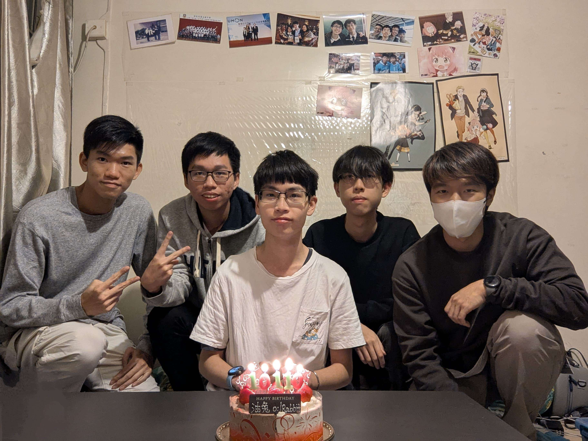
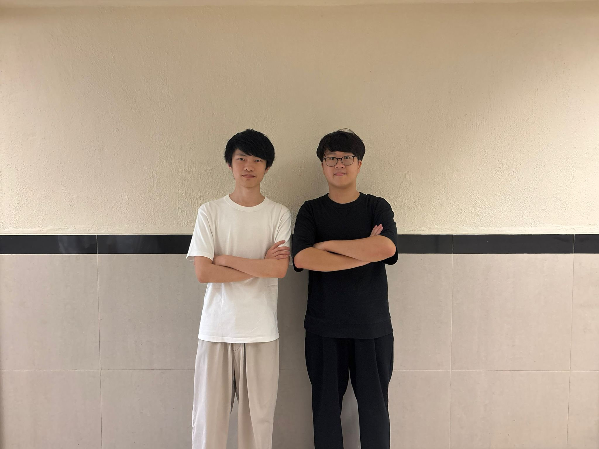
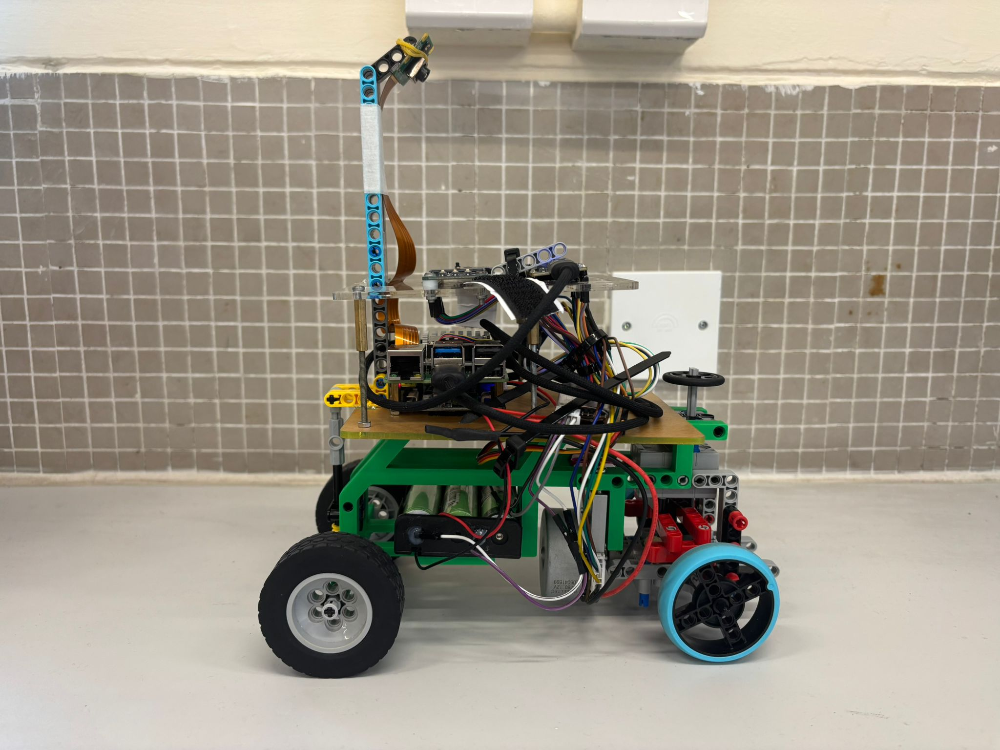

# Welcome to the GitHub Repository of Team Evo1ution for 2026 WRO Future Engineering 

## Links

[About Our Team](#about-our-team)

[Documentation](https://github.com/OilRabbit/2026-WRO-Future-Engineer/blob/Gen-1.0/Documentation/2026WROFEReport.pdf)

[Vehicle photos](vehicle_photos)

[Practice Videos](https://github.com/OilRabbit/2026-WRO-Future-Engineer/tree/Gen-1.0/video/video.md)

[Our Code](https://github.com/OilRabbit/2026-WRO-Future-Engineer/tree/Gen-1.0/src)

[Wiring Diagram](https://github.com/OilRabbit/2026-WRO-Future-Engineer/blob/Gen-1.0/schemes/Kicad/gen1_wiringdiagram.pdf)

[Building Instructions](https://github.com/OilRabbit/2026-WRO-Future-Engineer/blob/Gen-1.0/Documentation/FE%20building%20instructions.pdf)

## About Our Team

Our team consists of seven alumni from Po Leung Kuk Tang Yuk Tien College, each of whom previously served as chairperson of the school’s Robotics Team or has a strong interest in robotics. Over years of competitions and training, we have built strong friendships and developed a shared commitment to robotics. Last year, our team participated in the WRO Singapore final and placed 28th. Although we want to achieve higher this year, two of our teammates cannot participate due to academic reasons. Thus, we have two new teammates this year, Harrison and Donald become part of our supporters this year.

### Members' Introductions

#### Kyle Cheung (Participant) – Age 18
Kyle, a secondary school graduate, is responsible for program development in the PLKTYTC Robotics Team. He achieved first and second place in the 2023 and 2024 WRO Hong Kong RoboSports category. While preparing for the 2026 Robocon Hong Kong Contest, he draws on his strong competition background.

#### Marco Lam (Participant) – Age 19
Marco, an Enrichment Stream in Theoretical Physics student at The Chinese University of Hong Kong, is responsible for developing the main program, conducting module tests, and fine-tuning robot performance across diverse sce-narios. Although this is his first robotics competition since primary school, his strong foundation in programming — highlighted by achieving Honourable Mention in the Hong Kong Olympiad in Informatics (2022–
2023) — has proven valuable to the team. 

#### Rex Sin (Participant) – Age 20
Rex is studying Computer Science in Australia, but remains fully engaged in our team via video conferencing. He leads strategy design, debugging, and solution development, produces and uploads our YouTube videos, and co-ordinates this report. He began robotics at age 12 and won the U.S. Robot Parade world championship represent-ing Hong Kong, later earning numerous local competition awards.

#### Elwin Li (Coach) – Age 23
Elwin is an MPhil Physics student who previously coached the PLKTYTC Robotics Team and Physics Olympiad class. With expertise in physics, mathematics, and programming, he contributes to university research on gravita-tional waves. In our team, he directs meeting planning, goal setting, task assignment, sponsorship coordination, hardware procurement, and, most critically, programming strategy. Elwin also competed in the 2021 Robocon Hong Kong Contest and served as a judge for the 2024 WRO Hong Kong Future Engineer selection.

#### Donald Tong (Supporter) – Age 20
Donald, a Civil and Environmental Engineering student and PLKTYTC Robotics Team coach, develops core li-braries and functions, fine-tunes robot behavior, and conducts extensive operational tests, such as evaluating var-ied object placements. He and Rex Sin earned second place in the 2024 WRO Hong Kong Senior Robomission selection, and he previously placed second in the 2019 international Beach Rescue and Salvage Robot contests.

#### Harrison Tsang (Supporter) – Age 21
Studying Artificial Intelligence: Systems and Technologies, Harrison coaches the PLKTYTC Robotics Team and leads our robot construction and primary program development. While preparing concurrently for the 2025 Ro-bocon Hong Kong Contest, he brought experience as the 2021 WRO Hong Kong Senior RoboMission champion and multiple world-title winner in international robotics that year.

#### Harold Cheung (Supporter) – Age 24
Harold is a final-year Aeronautical and Aviation Engineering student and former PLKTYTC Robotics Team coach, specializing in mechanical design and robot structures. In our team, he delivers vehicle fundamentals training, oversees mechanical design, advises on sensor integration and strategy, and assists with component procure-ment. A motorsport enthusiast and amateur go-kart racer, Harold has competed alongside Elwin in robotics con-tests for over ten years, even leveraging insights from his personal kart to inform our robot’s design.

----

## Our design for the previous Copetition
During the previous Competition, we selected the ESP32 as controller and the BM50 brushless motor with an encoder for the drive. It offers additional stability, acting like a gyroscope while in operation, and features a built-in en-coder for precise power control. The smart car analyse the situation using a lot sensors, such as IMU, ToF sensors and camera(PixyCam2.1). The chassis was built with 3D printed frame and arcylic plates, assisted with LEGO components to connect the Ackermann system and wheels. 

However, we found that the PixyCam2.1 feedback is not stable and it was prone to overexposure in the venue of competition. Moreover, the large amount of sensors made the vehicle bulky and increased the difficulty of connecting and repairing them.

----

## Our current design

This year, we are trying to measure the field with the camera only. This requires a reliable camera and a powerful processor to observe the field and analyse the graphical data. After researching other teams’ choices on camera, we decided to use the Raspberry Pi and its camera for this task due to the stability and high processing power.

Our new front-wheel drive system is also worth mentioning. We choose a front-wheel drive (FWD) drivetrain because it provides stable and predictable handling during auton-omous driving. The front wheels both steer and drive the vehicle, allowing them to pull the robot through corners and helping it maintain the intended trajectory. 

----

## Building instructions

----

## Our libraries for ESP32
### LED
Storing functions for changing the colour of the LED on the ESP32, which help indicate the state of the vehicle. Those functions are made just in case that we need them one day. They can be used for indicating the state of program while debugging.
### OC
Storing the main program for the challenge and the function for showing the run time.
### Serial
Storing functions for communicating with the Raspberry Pi. Those functions are not only responsible for sending and receiving message, but also translating command message for controlling electronic components.
### buttons
Storing functions that define the behaviour of buttons.
### calculation
Storing functions of math formulas that are frequently used. As the official library of motor and sensors might take values in different unit, some of those functions help us do the convertion.
### main
The program that initialise the threads and libraries.
### motor
Storing functions for controlling the BM50 motor, including that reads the value of its encoder. Those functions give us various ways to controll the motor, such as turn for certain degrees, and adding acceleration and deceleration.
### steering
Storing the functions for controlling the servo motor to do turning.
### tft
Storing the functions for printing messages on the monitor. Those functions are very useful in debugging, especially when we need to know some values while the program is running.
### timestamp
Storing a function to put into display thread for showing the time elapsed from the start of the smart car.
## Our libraries for Raspberry Pi
### camera_utils
Storing functions for analysing feedback from the camera, including those help recognise the track, the obstacles, and the parking lot.
### communications
Storing the functions that manage the communication with ESP32. The function for sending commands to ESP32 is frequently used for telling the state of the vehicle base on the camera feedback.

----

## What we learnt
* Slip angle optimisation is unnecessary for our small robot, the Ackermann effect is minimal, though we demonstrated a simple LEGO implementation regardless.
* A differential is essential: it significantly smooths turning at low speeds despite a slight reduction in straight‐line velocity.
* A shorter wheelbase enhances turning fluidity.
* A wider track during turns, greater spacing between front wheels than rear, improves cornering smooth-ness (we omitted this due to chassis‐width constraints).
* Lightweight wheels markedly increase top speed more than reducing overall vehicle mass.
* Smaller wheel diameters boost manoeuvrability.
* A low centre of mass enhances stability.
* An onboard gyro provides precise heading data and lap counting.
* Storing pillar colours in an array on the first detection enables faster reaction on subsequent passes.
* Reducing camera resolution (where feasible) increases frame rate and responsiveness.

----

## Conclusion
This is a really challenging project as this is our first time using those hardware and there are so many things need to learn for this. We enjoy the process of searching through the field we love and learning something new. We believe that what we learnt from this competition is more valuable than the result.

----

## Special thanks
Our sponsors:

| [Peach Creatice Production](https://www.peachcp.com/wp/) | [TURNED-E!](https://www.turned-e.com/) | [Scarlet Racing](https://www.facebook.com/scarlet.racing.hk/?locale=zh_HK) | Electronic Slash |
| -------- | -------- | -------- | -------- |
|||||

Also thank to our parents, coach and supporter for supporting us to explore the field we love.
